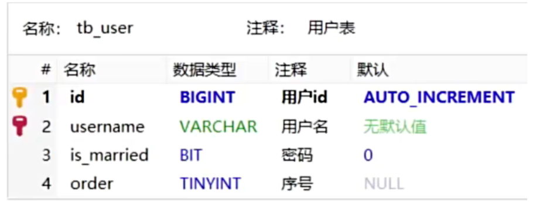

# Annotation

- [Annotation](#annotation)
    * [@TableName](#-tablename)
    * [@TableId](#-tableid)
    * [@TableField](#-tablefield)

## 1. Introduction

In the above quick start example, we just injected dependency and inherited BaseMapper to use MybatisPlus, which is very
simple.

**But here's the question**: How does the MybatisPlus know which table we're looking up and what fields in the table?

In the UserMapper, we specify the type of the **User** Pojo


**Answer**: MybatisPlus `infers`(推断) table information based on Pojo entity to generate SQL statements.

1. MybatisPlus will use field **id** as the primary key.
2. MybatisPlus will `hump to`(驼峰转) underline all variable names of Pojo entity as field names of table.
3. Infer field type from variable type.

```java
public class User implements Serializable {
    private Long id;            // as primary key.
    private Date createTime;    // table field name is `create_Time`
    // ... 
}
```

But in many cases, the default implementation does not match the actual `scenario`(场景), so MybatisPlus provides some
annotations to `facilitate`(促进) us to declare table information.

***

## 2. @TableName

### 2.1 Why

In the MybatisPlus, the name of class corresponds to table name by default, as the following:

```java
// Mybatis will convert the name to "user",
// and then match the table user in the database.
public class User {   //--------------> user table. 
    //.....
}
```

**But here's the question**: If the name of class is not user, which table will be matched?

**Answer**:  MybatisPlus provides the annotation `@TableName` to infer which tables we want.

### 2.2 Use

```java

@TableName("user")
public class LoginUser implements Serializable {
    private Long id;
    private String name;
}
```

### 2.3 Illustration

- **Description**: Table annotation to identify the table corresponding to the entity class.
- **Use location**:  entity class.

...

*** 

## 3. @TableId

### 3.1 Why

MybatisPlus will use the id filed as the primary key of the table by default, as the following.

```java

@TableName("user")
public class User {   //--------------> user table. 
    private Long id;   // primary key.
    // .... 
}
```

**But here's the question**: If the field name is not "id", MybatisPlus can not get the data by primary key.

**Answer**: MybatisPlus provides the annotation `@TableId` to `explicitly`(显式地) mark a specific field in the entity
class as primary key.

### 3.2 Parameters

| Attributes | Type   | 是否必须指定 | Default     | Description         |
|------------|--------|--------|-------------|---------------------|
| value      | String | No     | ""          | primary key         |
| type       | Enum   | No     | IdType.NONE | type of primary key |

We can specify the primary key auto-increment `strategy`(策略).

| Value       | Description                                                                                          |
|-------------|------------------------------------------------------------------------------------------------------|
| ASSIGN_ID   | ( **Default** ) Type of primary key is Long and Interger or String, using `snowflake`(雪花) algorithm) |
| AUTO        | Auto increase.                                                                                       | 
| INPUT       | the same as NONE.                                                                                    |
| ASSIGN_UUID | Type is String, value is **UUID**.                                                                   |

### 3.3 Use

```java

@TableName("sys_user")
public class User {   //--------------> user table.
    @TableId(value = "id", type = IdType.AUTO)
    private Long userId;  // primary key.
    // .... 
}
```

*** 

## 4. @TableField

### 4.1 Why

Here is the fields of table:



In general, we don't add `@TableField` to fields, except in some special cases:

1. variable is `inconsistent`(不一致) with the name of the table.
2. variable's format is "isXXX", according to the JavaBean specification, MybatisPlus will remove "is" when identifying
   fields, which leads to inconsistent with the table.
3. variable is consistent with the name of fields, but it `conflicts with`(与..冲突/矛盾) keyword of the database.

```java

@TableName("tb_user")
public class User {

    @TableId(value = "id", type = IdType.AUTO)
    private Long id;

    @TableField("username")
    private String name;

    @TableField("is_married")
    private Boolean isMarried;

    @TableField("`order`")   // add ` ` 
    private Integer order;

    // This annotation is likely intended to be '@TableField(exist = false)', but it doesn't seem to be a valid option. If you want to exclude a field from being mapped to the database, use '@TableField(ignore = true)' instead.
    @TableField(exist = false)
    private String address;
}
```

***
