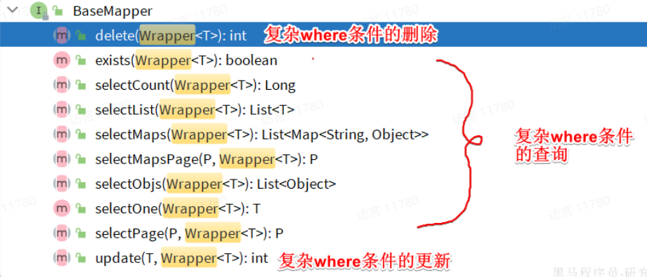
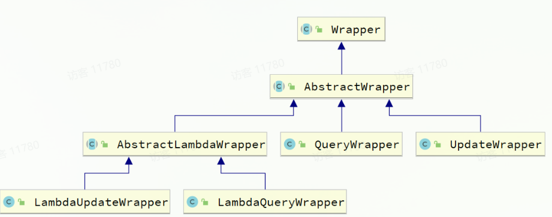
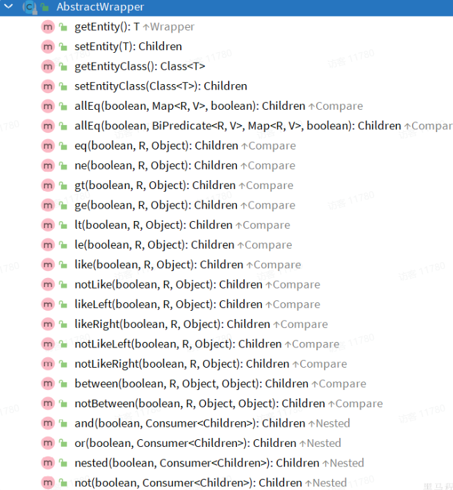
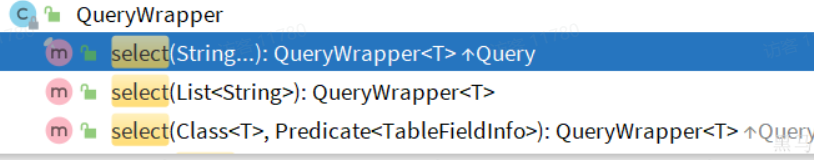
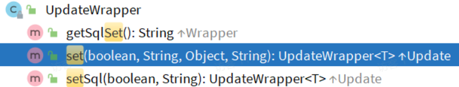

# Conditional Query

- [Conditional Query](#conditional-query)
    * [1. Introduction](#1-introduction)
    * [2. QueryWrapper](#2-querywrapper)
    * [3. UpdateWrapper](#3-updatewrapper)
    * [4. LambdaQueryWrapper](#4-lambdaquerywrapper)

## 1. Introduction

In addition to add data, we often specify a where condition for modifying, deleting and querying SQL statements.

Therefore, in addition to the id as a where condition, the related methods provided in **BaseMapper** also support more
complex conditional query.



The Wrapper in the argument is an abstract class of conditional construction, and there are many default implementations
under it, and the inheritance relationship is as follows:



Wrapper's subclass, **AbstractWrapper** provides all the conditional constructors methods:




***

## 2. QueryWrapper

QueryWrapper extends AbstractWrapper, and provides a select method to specify the fields to be displayed.



Whether we modify, delete, or query, we can use QueryWrapper to build query conditions.

1. Query: To query whose name contains a letter of "o" and `have a deposit of`(有多少存款) at least 1000 yuan.
    ```java
    
    @Test
    void testQueryWrapper() {
        // 1. Construct conditional query.
        QueryWrapper<User> wrapper = new QueryWrapper<User>()
                .select("id", "username", "info")    // display fields
                // where condition.
                .like("username", "o")  // name like "%o%".
                .ge("balance", 1000);   // balance => 1000
        // 2.查询数据
        List<User> users = userMapper.selectList(wrapper);
        users.forEach(System.out::println);
    }
    
    ```

2. Update: To update the balance of the user whose name is jack to 2000.

    ```java
    
    @Test
    void testQueryWrapper() {
        // 1. Construct conditional query.
        QueryWrapper<User> wrapper = new QueryWrapper<User>()
                .eq("username", "jack");
    
        User user = new User();
        user.setBalance(2000);
    
        // 2. Update data.
        userMapper.update(user, wrapper);
    }
    
    ```

***

## 3. UpdateWrapper

The UpdateWrapper extends a "SET" method on AbstractWrapper, allowing us to specify the "SET" part of the SQL.



Based on the update method in **BaseMapper**, we can only directly assign values when you update, which is difficult to
implement for some complex requirements.

Update user's balance with ID 1,2,4, and `deduct`(扣除) 200, the corresponding SQL is :

```sql
UPDATE user 
    Set balance  = balance - 200
    WHERE id in (1,2,4)
```

The corresponding Java code is as follows:

```java

@Test
void testUpdateWrapper() {
    List<Long> ids = List.of(1L, 2L, 4L);

    UpdateWrapper<User> wrapper = new UpdateWrapper<User>()
            .setSql("balance = balance - 200") // SET balance = balance - 200
            .in("id", ids); // WHERE id in (1, 2, 4)

    // Update 
    userMapper.update(null, wrapper);
}
```

***

## 4. LambdaQueryWrapper

Whether it is a query wrapper or an update wrapper, you need to write the dead field name when constructing the
condition, and the string magic value will appear. This is clearly not recommended in the programming specification.

So how can we know the field name without writing the field name?

One way to do this is a variable-based getter method combined with reflection techniques.
So we just need to pass the **getter** method of the field corresponding to the condition to MybatisPlus, and it will
be able to calculate the corresponding variable name.

Therefore, MybatisPlus provides a set of Lambda-based wrappers:

- LambdaQueryWrapper
- LambdaUpdateWrapper

```java

@Test
void testLambdaQueryWrapper() {
//    LambdaQueryWrapper<User> wrapper = new LambdaQueryWrapper<>();
    QueryWrapper<User> wrapper = new QueryWrapper<>();
    wrapper.lambda()
            .select(User::getId, User::getUsername, User::getInfo, User::getBalance)
            .like(User::getUsername, "o")
            .ge(User::getBalance, 1000);

    List<User> users = userMapper.selectList(wrapper);
    users.forEach(System.out::println);
}
```