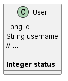
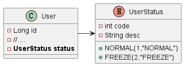

# Enumeration Handler

- [Enumeration Handler](#enumeration-handler)
    * [1. Application Scenarios](#1-application-scenarios)
    * [2. Quick Start](#2-quick-start)
        + [2.1 Define Enumeration](#21-define-enumeration)
        + [2.2 Enumeration Handler](#22-enumeration-handler)
        + [2.3 Test](#23-test)

## 1. Application Scenarios

There is a filed in the User entity.



We usually need to make a judgement and convert to String based on status, then return like this:

```java

@SpringBootTest
public class UserTest {

    @Autowired
    private UserMapper userMapper;


    @Test
    void test() {
        LambdaQueryWrapper<User> queryWrapper = new LambdaQueryWrapper<>();

        // If the business would be changed
        // it is a trouble that we need to modify each value.
        queryWrapper.eq(User::getStatus, 1);

        // we just need to modify the UserStatus.NORMAL value.
        queryWrapper.eq(User::getStatus, UserStatus.NORMAL);

        List<User> list = userMapper.selectList(queryWrapper);
        list.forEach(System.out::println);
    }
}

```

***

## 2. Quick Start



### 2.1 Define Enumeration

1. UserEnum entity.

   To let MP handle the automatic conversion of the enumeration and database types, we must add `@EnumValue` in the
   fields for telling the MP which field is needed.
    ```java
    
    @NoArgsConstructor
    @AllArgsConstructor
    @Getter
    public enum UserStatus {
        NORMAL(1, "NORMAL"),
        FREEZE(2, "FREEZE");
    
        @EnumValue
        private int code;
    
        private String desc;
    }
    ```


2. Modify the User

    ```java
    
    @Data
    @AllArgsConstructor
    @NoArgsConstructor
    @TableName("user")
    public class User {
        @TableId(value = "id")
        private Long id;
        private String username;
    
        // .....
        
        private UserStatus status;
    }
    
    ```

### 2.2 Enumeration Handler

```yaml
mybatis-plus:
  configuration:
    # EnumHandler
    default-enum-type-handler: com.baomidou.mybatisplus.core.handlers.MybatisEnumTypeHandler

```

### 2.3 Test

```java

@SpringBootTest
public class UserTest {

    @Autowired
    private UserMapper userMapper;


    @Test
    void test() {
        LambdaQueryWrapper<User> queryWrapper = new LambdaQueryWrapper<>();

        queryWrapper.eq(User::getStatus, UserStatus.NORMAL);

        List<User> list = userMapper.selectList(queryWrapper);
        list.forEach(System.out::println);
    }
}
```

```bash
18:57:57 DEBUG 2640 --- [           main] c.example.mapper.UserMapper.selectList   : ==>  Preparing: SELECT id,username,password,phone,info,status,balance,create_time,update_time FROM user WHERE (status = ?)
18:57:57 DEBUG 2640 --- [           main] c.example.mapper.UserMapper.selectList   : ==> Parameters: 1(Integer)
18:57:57 DEBUG 2640 --- [           main] c.example.mapper.UserMapper.selectList   : <==      Total: 6
User(id=1, username=Jack, password=123, phone=13900112224, info={"age": 20, "intro": "佛系青年", "gender": "male"}, status=NORMAL, balance=1600, createTime=Fri May 19 20:50:21 CST 2023, updateTime=Mon Jun 19 20:50:21 CST 2023)
User(id=2, username=Rose, password=123, phone=13900112223, info={"age": 19, "intro": "青涩少女", "gender": "female"}, status=NORMAL, balance=600, createTime=Fri May 19 21:00:23 CST 2023, updateTime=Mon Jun 19 21:00:23 CST 2023)
User(id=3, username=Hope, password=123, phone=13900112222, info={"age": 25, "intro": "上进青年", "gender": "male"}, status=NORMAL, balance=100000, createTime=Mon Jun 19 22:37:44 CST 2023, updateTime=Mon Jun 19 22:37:44 CST 2023)
User(id=4, username=Thomas, password=123, phone=17701265258, info={"age": 29, "intro": "伏地魔", "gender": "male"}, status=NORMAL, balance=800, createTime=Mon Jun 19 23:44:45 CST 2023, updateTime=Mon Jun 19 23:44:45 CST 2023)
User(id=9, username=Lucy, password=123, phone=18688990011, info={"age": 24, "intro": "英文老师", "gender": "female"}, status=NORMAL, balance=200, createTime=Wed Apr 24 16:13:24 CST 2024, updateTime=Wed Apr 24 16:13:24 CST 2024)
User(id=11, username=RainbowJier, password=123, phone=18688990011, info={"age": 24, "intro": "英文老师", "gender": "female"}, status=NORMAL, balance=200, createTime=Wed Apr 24 16:15:12 CST 2024, updateTime=Wed Apr 24 16:15:12 CST 2024)

```
