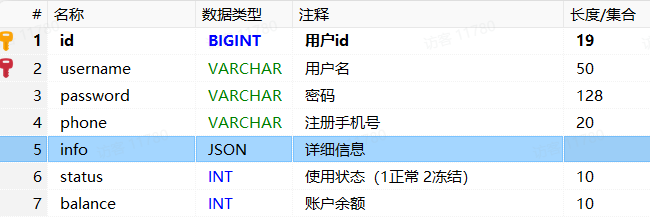
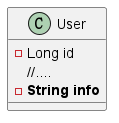
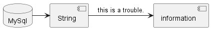
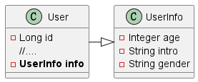

# Json Handler

## 1. Introduction

There is a filed in the user table.



the format is:

```json
{
  "age": 20,
  "intro": "佛系青年",
  "gender": "male"
}
```

But the type in `User` is String.



It's a trouble that we need to get the information in the field.



If we want to easily obtain if, the type of info is preferably a Map or entity class, like this:



***

## 2. Quick Start

### 2.1 UserInfo entity

```java

@Data
public class UserInfo {
    private Integer age;
    private String intro;
    private String gender;
}
```

### 2.2 JacksonTypeHandler

MybatisPlus provides many type processor for special types of fields to solve the problem of conversion between special
field types and database types.

For example, when processing JSON, we can use the JacksonHandler processor.

1. Add JacksonHandler.
2. Open the `autoResultMap = true` in `@TableName`.

```java

@Data
@AllArgsConstructor
@NoArgsConstructor
@TableName(value = "user", autoResultMap = true)  // open 
public class User {
    @TableId(value = "id")
    private Long id;
    //.....
    @TableField(typeHandler = JacksonTypeHandler.class)   // JacksonHandler
    private UserInfo info;


}
```

### 2.3 Test

```java

@SpringBootTest
public class UserTest {

    @Autowired
    private UserMapper userMapper;


    @Test
    void test() {
        LambdaQueryWrapper<User> queryWrapper = new LambdaQueryWrapper<>();
        queryWrapper.eq(User::getStatus, UserStatus.NORMAL);

        List<User> list = userMapper.selectList(queryWrapper);

        list.forEach(System.out::println);
    }
}
```

```bash
20:09:04 DEBUG 8844 --- [           main] c.example.mapper.UserMapper.selectList   : ==>  Preparing: SELECT id,username,password,phone,info,status,balance,create_time,update_time FROM user WHERE (status = ?)
20:09:04 DEBUG 8844 --- [           main] c.example.mapper.UserMapper.selectList   : ==> Parameters: 1(Integer)
20:09:04 DEBUG 8844 --- [           main] c.example.mapper.UserMapper.selectList   : <==      Total: 6
User(id=1, username=Jack, password=123, phone=13900112224, info=UserInfo(age=20, intro=佛系青年, gender=male), status=NORMAL, balance=1600, createTime=Fri May 19 20:50:21 CST 2023, updateTime=Mon Jun 19 20:50:21 CST 2023)
User(id=2, username=Rose, password=123, phone=13900112223, info=UserInfo(age=19, intro=青涩少女, gender=female), status=NORMAL, balance=600, createTime=Fri May 19 21:00:23 CST 2023, updateTime=Mon Jun 19 21:00:23 CST 2023)
User(id=3, username=Hope, password=123, phone=13900112222, info=UserInfo(age=25, intro=上进青年, gender=male), status=NORMAL, balance=100000, createTime=Mon Jun 19 22:37:44 CST 2023, updateTime=Mon Jun 19 22:37:44 CST 2023)
User(id=4, username=Thomas, password=123, phone=17701265258, info=UserInfo(age=29, intro=伏地魔, gender=male), status=NORMAL, balance=800, createTime=Mon Jun 19 23:44:45 CST 2023, updateTime=Mon Jun 19 23:44:45 CST 2023)
User(id=9, username=Lucy, password=123, phone=18688990011, info=UserInfo(age=24, intro=英文老师, gender=female), status=NORMAL, balance=200, createTime=Wed Apr 24 16:13:24 CST 2024, updateTime=Wed Apr 24 16:13:24 CST 2024)
User(id=11, username=RainbowJier, password=123, phone=18688990011, info=UserInfo(age=24, intro=英文老师, gender=female), status=NORMAL, balance=200, createTime=Wed Apr 24 16:15:12 CST 2024, updateTime=Wed Apr 24 16:15:12 CST 2024)

```