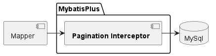
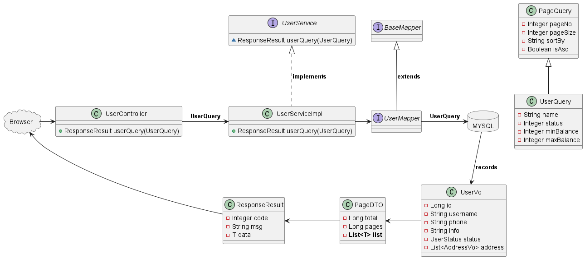

# Pagination

## 1. Introduction

MybatisPlus provides a lot of plugins to further expand its functions. Currently available plugins include:

- `PaginationInnerInterceptor`: **Automatic pagination**.
- `TenantLineInnerInterceptor`
- `DynamicTableNameInnerInterceptor`：Dynamic table name.
- `OptimisticLockerInnerInterceptor`: Optimistic Locker
- `IllegalSQLInnerInterceptor`: sql performance restriction.
- `BlockAttackInnerInterceptor`: To prevent full table updates or deletions.

***

## 2. Quick Start



### 2.1 Mybatis Configuration

Create `MybatisPlusConfig` in the package config.

```java

@Configuration
public class MybatisConfig {
    @Bean
    public MybatisPlusInterceptor mybatisPlusInterceptor() {
        MybatisPlusInterceptor interceptor = new MybatisPlusInterceptor();

        // Add pagination plugin.
        interceptor.addInnerInterceptor(new PaginationInnerInterceptor(DbType.MYSQL));
        return interceptor;
    }
}
```

### 2.2 Pagination API

```java

@Test
void Pagination() {
    int pageNo = 1, pageSize = 3;
    Page<User> page = Page.of(pageNo, pageSize);   // Pagination API  

    // Order
    OrderItem orderItem = new OrderItem()
            .setColumn("balance")
            .setAsc(false);
    page.addOrder(orderItem);

    // Query Page
    Page<User> userPage = userMapper.selectPage(page, null);

    long total = userPage.getTotal();
    System.out.println("Total: " + total);
    List<User> records = userPage.getRecords();  // Store the result in List.
    records.forEach(System.out::println);
}
```

```bash
14:14:25 DEBUG 3764 --- [           main] c.e.m.UserMapper.selectList_mpCount      : ==>  Preparing: SELECT COUNT(*) AS total FROM user
14:14:25 DEBUG 3764 --- [           main] c.e.m.UserMapper.selectList_mpCount      : ==> Parameters: 
14:14:25 DEBUG 3764 --- [           main] c.e.m.UserMapper.selectList_mpCount      : <==      Total: 1

14:14:25 DEBUG 3764 --- [           main] c.example.mapper.UserMapper.selectList   : ==>  Preparing: SELECT id, username, password, phone, info, status, balance, create_time, update_time FROM user ORDER BY balance DESC LIMIT ?
14:14:25 DEBUG 3764 --- [           main] c.example.mapper.UserMapper.selectList   : ==> Parameters: 3(Long)
14:14:25 DEBUG 3764 --- [           main] c.example.mapper.UserMapper.selectList   : <==      Total: 3

Total: 6
User(id=3, username=Hope, password=123, phone=13900112222, info=UserInfo(age=25, intro=上进青年, gender=male), status=NORMAL, balance=100000, createTime=Mon Jun 19 22:37:44 CST 2023, updateTime=Mon Jun 19 22:37:44 CST 2023)
User(id=1, username=Jack, password=123, phone=13900112224, info=UserInfo(age=20, intro=佛系青年, gender=male), status=NORMAL, balance=1600, createTime=Fri May 19 20:50:21 CST 2023, updateTime=Mon Jun 19 20:50:21 CST 2023)
User(id=4, username=Thomas, password=123, phone=17701265258, info=UserInfo(age=29, intro=伏地魔, gender=male), status=NORMAL, balance=800, createTime=Mon Jun 19 23:44:45 CST 2023, updateTime=Mon Jun 19 23:44:45 CST 2023)
```

*** 

## 3. Pagination entity



### 3.1 Entity

1. UserQuery
    ```java
    @Data
    @AllArgsConstructor
    @NoArgsConstructor
    @Accessors(chain = true)
    @ApiModel(description = "Query Entity")
    public class UserQuery extends PageQuery {
        @ApiModelProperty("用户名关键字")
        private String name;
        @ApiModelProperty("用户状态：1-正常，2-冻结")
        private Integer status;
        @ApiModelProperty("余额最小值")
        private Integer minBalance;
        @ApiModelProperty("余额最大值")
        private Integer maxBalance;
    }
    ```
2. PageQuery
    ```java
    @Data
    @Accessors(chain = true)
    @ApiModel(description = "分页查询实体")
    @AllArgsConstructor
    @NoArgsConstructor
    public class PageQuery {
        @ApiModelProperty("Page No")
        private Integer pageNo;
    
        @ApiModelProperty("Page size")
        private Integer pageSize;
    
        @ApiModelProperty("Sorted filed")
        private String sortBy;
    
        @ApiModelProperty("Asc")
        private Boolean isAsc;
    }
    ```

### 3.2 Controller

```java

@Api(tags = "Test Swagger")
@RestController
@RequestMapping("user")
public class UserController {

    @Autowired
    private UserService userService;

    @ApiOperation("Test Controller")
    @PostMapping("query")
    public ResponseResult userQuery(@RequestBody UserQuery userQuery) {

        return userService.userQuery(userQuery);
    }

}

```

### 3.3 Service

1. UserService

```java
public interface UserService {

    ResponseResult userQuery(UserQuery query);

}
```

2. UserServiceImpl

```java

@Service
public class UserServiceImpl implements UserService {
    @Autowired
    UserMapper userMapper;

    @Override
    public ResponseResult userQuery(UserQuery userQuery) {
        Page<User> page = Page.of(userQuery.getPageNo(), userQuery.getPageSize());
        // Order
        OrderItem orderItem = new OrderItem();
        if (userQuery.getSortBy() != null) {
            orderItem.setColumn(userQuery.getSortBy())
                    .setAsc(userQuery.getIsAsc());
        } else {
            orderItem.setColumn("update_time")
                    .setAsc(userQuery.getIsAsc());
        }
        page.addOrder(orderItem);


        // Query Page
        LambdaQueryWrapper<User> queryWrapper = new LambdaQueryWrapper<>();   //Query Wrapper
        Page<User> userPage = userMapper.selectPage(page, null);
        List<User> records = userPage.getRecords();
        // records.forEach(System.out::println);


        //Check if the result is null.
        if (records.isEmpty()) {
            return new ResponseResult<>(200, "Response Successfully.", null);
        }

        // Convert records into UserVo
        List<UserVo> userVos = BeanUtil.copyToList(records, UserVo.class);

        //Store to PageDTO
        PageDTO<UserVo> userVoPageDTO = new PageDTO<UserVo>(userPage.getTotal(), userPage.getPages(), userVos);

        //Store to Result
        ResponseResult<PageDTO> responseResult = new ResponseResult<>(200, "Response Successfully.", userVoPageDTO);

        return responseResult;
    }
}

```

### 3.4 Mapper

```java

@Mapper
public interface UserMapper extends BaseMapper<User> {
}

```

### 3.5 PageDTO

```java

@Data
@AllArgsConstructor
@NoArgsConstructor
@ApiModel(description = "Page Result")
public class PageDTO<T> {
    @ApiModelProperty("Page Size")
    private Long total;

    @ApiModelProperty("Total Pages")
    private Long pages;

    @ApiModelProperty("Result List")
    private List<T> list;
}
```

### 3.6 UserVo

```java

@Data
@AllArgsConstructor
@NoArgsConstructor
public class UserVo {
    private Long id;
    /**
     * 用户名
     */
    private String username;
    /**
     * 注册手机号
     */
    private String phone;
    /**
     * 详细信息
     */
    private String info;
    /**
     * 使用状态（1正常 2冻结）
     */
    private UserStatus status;

    private List<AddressVo> address;
}

```

### 3.7 ResponseResult

```java

@Data
// If properties are null, and it is not converted into Json object.
@JsonInclude(JsonInclude.Include.NON_NULL)
@AllArgsConstructor
@NoArgsConstructor
public class ResponseResult<T> {
    private Integer code;
    private String msg;
    private T data;
}
```

### 3.8 Test

```json
{
  "code": 200,
  "msg": "Response Successfully.",
  "data": {
    "total": 6,
    "pages": 2,
    "list": [
      {
        "id": 1,
        "username": "Jack",
        "phone": "13900112224",
        "info": "{\"age\": 20, \"intro\": \"佛系青年\", \"gender\": \"male\"}",
        "status": "NORMAL",
        "address": null
      },
      {
        "id": 2,
        "username": "Rose",
        "phone": "13900112223",
        "info": "{\"age\": 19, \"intro\": \"青涩少女\", \"gender\": \"female\"}",
        "status": "NORMAL",
        "address": null
      },
      {
        "id": 3,
        "username": "Hope",
        "phone": "13900112222",
        "info": "{\"age\": 25, \"intro\": \"上进青年\", \"gender\": \"male\"}",
        "status": "NORMAL",
        "address": null
      }
    ]
  }
}
```

***

## 4. Optimization

```java

@Service
public class UserServiceImpl implements UserService {
    @Autowired
    UserMapper userMapper;

    @Override
    public ResponseResult userQuery(UserQuery userQuery) {
        //........

        // Query Page
        LambdaQueryWrapper<User> queryWrapper = new LambdaQueryWrapper<>();   //Query Wrapper
        Page<User> userPage = userMapper.selectPage(page, null);


        List<User> records = userPage.getRecords();
        //Check if the result is null.
        if (records.isEmpty()) {
            return new ResponseResult<>(200, "Response Successfully.", null);
        }
        // Convert records into UserVo
        List<UserVo> userVos = BeanUtil.copyToList(records, UserVo.class);


        //Store to PageDTO
        PageDTO<UserVo> userVoPageDTO = new PageDTO<UserVo>(userPage.getTotal(), userPage.getPages(), userVos);

        //Store to Result
        ResponseResult<PageDTO> responseResult = new ResponseResult<>(200, "Response Successfully.", userVoPageDTO);

        return responseResult;
    }
}
```

After querying the paging result, the non-null verification of the data and the vo conversion of the data are all
template codes, which are very troublesome.

We can completely encapsulate it into the method of **PageDTO**.

### PageDTO

```java

@Data
@AllArgsConstructor
@NoArgsConstructor
@ApiModel(description = "Page Result")
public class PageDTO<T> {
    @ApiModelProperty("Page Size")
    private Long total;

    @ApiModelProperty("Total Pages")
    private Long pages;

    @ApiModelProperty("Result List")
    private List<T> list;


    /**
     * 泛型方法
     * Process null page
     *
     * @param page
     * @param <P>  只有加上这个，说明这个方法是泛型方法
     * @return
     */
    public static <P, V> PageDTO<V> empty(Page<P> page) {
        return new PageDTO<>(page.getPages(), page.getTotal(), Collections.emptyList());
    }


    /**
     * Convert data
     *
     * @param page
     * @param voClass
     * @param <P>
     * @param <V>
     * @return
     */
    public static <P, V> PageDTO<V> of(Page<P> page, Class<V> voClass) {
        List<P> records = page.getRecords();
        if (records.isEmpty()) {
            return empty(page);
        }

        // Convert data
        List<V> vos = BeanUtil.copyToList(records, voClass);

        // Return
        return new PageDTO<>(page.getPages(), page.getTotal(), vos);
    }

}
```

```java

@Service
public class UserServiceImpl implements UserService {
    @Autowired
    UserMapper userMapper;

    @Override
    public ResponseResult userQuery(UserQuery userQuery) {
        //........


        // Query Page
        LambdaQueryWrapper<User> queryWrapper = new LambdaQueryWrapper<>();   //Query Wrapper
        Page<User> userPage = userMapper.selectPage(page, null);

        // Get the converted data.
        PageDTO<UserVo> userPageDTO = PageDTO.of(userPage, UserVo.class);

        //Store to Result
        ResponseResult<PageDTO> responseResult = new ResponseResult<>(200, "Response Successfully.", userPageDTO);

        return responseResult;
    }
}
```
